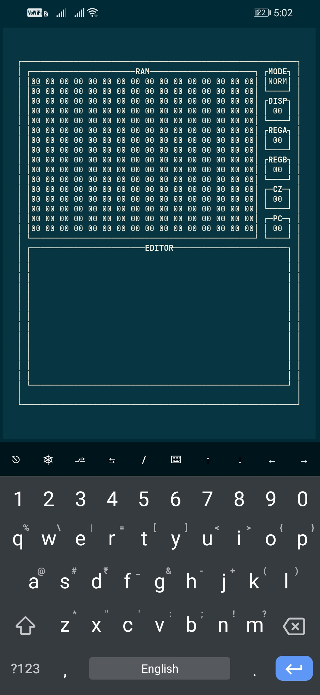
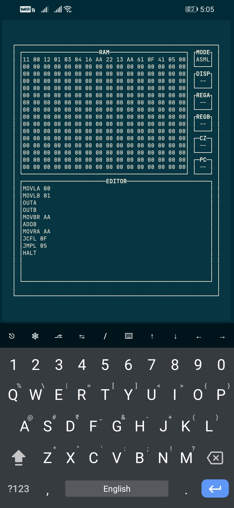
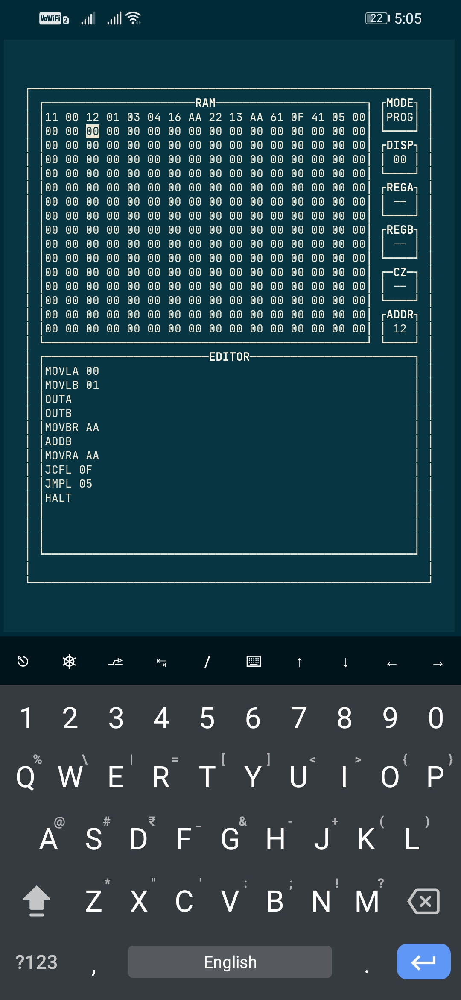
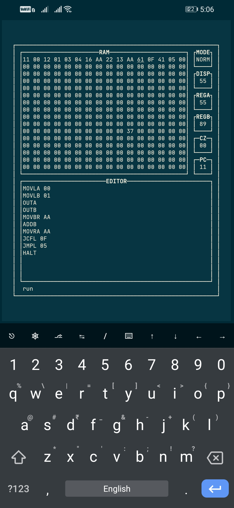

# MPU EMULATOR
This program in an 8 bit mpu emulator based on Ben Eater's 8 bit computer. 
The UI consists of:
- A RAM Windox
- A Command Window
- An Editor Window
- 5 Small Windows
The program is fully developed using Python Programming Language and Curses Library.

## Installation
This program uses python curses library and is intended to run in CLI Environment. This has been tested in zsh shell. Install python before use.

Copy this repository using:
```
git clone https://github.com/sudipta-nandan/mpu-emulator.git
```
Move to the `mpu-emulator` directory and type:
```
python main.py
```

## Modes
The emulator has 3 modes:
1. NORM -> [Normal Mode](#normal-mode)
2. PROG -> [Program Mode](#program-mode)
3. ASML -> [Assembly Mode](#assembly-mode)

For further details check [Commands](#commands) Section.

###### Normal Mode
The Default Mode when the emulator starts.
Used to Run commands.

###### Program Mode
The Program Mode is exclusively used to change data contained in RAM Memory Address.
The directional arrows '← ↑ ↓ →' are used to select specific Memory Address and 'Enter' to select the Address for editing purpose.

###### Assembly Mode
The Assembly Mode activates the in-built editor.
After pressing 'Enter', user can write their own piece of codes and run them in the emulator.
The Editor support both horizontal and vertical scrolling along with line splitting.
Pressing 'Esc' returns the piece of codes, compile them and updates the RAM accordingly.
The codes will be saved for the current session only.

## Display Modes
The emulator supports 2 display modes:
1. Decimal
2. Hexadecimal(Default)

These modes can only be changed in Normal Mode.
The modes change the display to Decimal or Hexadecimal System.
For further details check [Commands](#commands) Section.

**Only displayed value of DISP, REGA, REGB and PC is affected by these modes.
CZ shows the value in BINARY only.**

## Clock
The clock frequency of the emulator can be changed.
By defalut it's set to 10Hz.
For details check [Commands](#commands) Section.

## Commands
The Commands are entered in the Command Window.
To write command press `:`.

The following are the commands with their action:

1. `clk <freq in Hz>`: Changes the clock frequency.
2. `mode <MODE>`: Set the emulator to desired mode.
3. `disp <DEC/HEX>`: Set the display to desired mode. Only supported in 'NORM' mode.
4. `run`: Run the compiled code. Only supported in 'NORM' mode.
5. `quit`: Close the emulator. Only supported in 'NORM' mode.

## Screenshots

|Normal Mode| |Assembly Mode| |Program Mode|
|--| |--| |--|
|| || ||

|Running Fibonacci Sequence|
|--|
||
